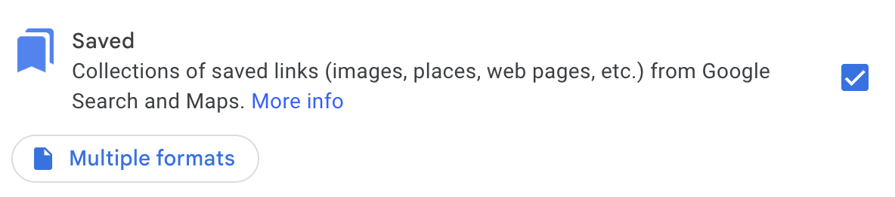
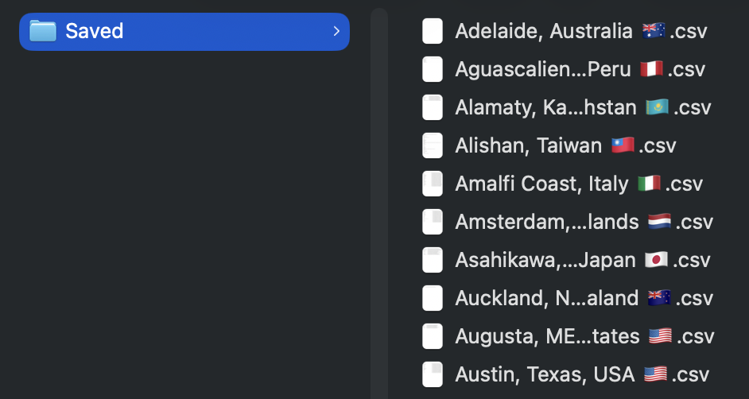

# Favorite Places

Static-first personal travel guides built from Google Maps saved lists.

Frontend package management and script execution use `bun`.
The scraper dependency is vendored into this repo as a git subtree at
`vendor/google-saved-lists/`, and `uv` installs it from that in-repo path.

## Stack

- Astro for the site
- Python + `uv` for scraping, normalization, and enrichment
- Cloudflare Pages or GitHub Pages for static hosting

## Commands

Install frontend dependencies:

```bash
bun install
```

Install Python dependencies:

```bash
uv sync
```

The repo pins Python via [`.python-version`](.python-version) so local `uv` usage and Cloudflare Pages builds both resolve the intended `3.14` runtime instead of Cloudflare's default `3.13.x`.

Optional local Google Places API key:

```bash
cp .env.example .env
```

Populate local raw data from public Google Maps lists:

```bash
bun run sync:sources
```

This refreshes every configured source and then rebuilds generated site data.
Public Google Maps URLs are always re-scraped. Local Google export CSV files are re-imported only when their
contents or config change.
Headless refreshes run up to 4 scraper workers in parallel by default. Use
`uv run python3 scripts/build_data.py --refresh --refresh-workers 1` to force
serial execution, or `--headed` to keep browser windows single-worker.

Force-refresh raw source imports even if a CSV input is unchanged:

```bash
bun run sync:sources:force
```

Refresh one configured source by slug, source URL, or source path:

```bash
bun run sync:source -- tokyo-japan
bun run sync:source -- https://maps.app.goo.gl/your-public-list
bun run sync:source -- data/imports/taipei-taiwan.csv
```

Build generated site data and the static browser search index from local raw JSON:

```bash
bun run build:data
```

Use this when `data/raw/` is already up to date and you only want to regenerate site inputs and search data.
Configured local CSV sources are auto-imported before rebuild. Public Google Maps URL sources are not refreshed here.

Fill missing or stale Google Places enrichment cache entries, then rebuild:

```bash
GOOGLE_PLACES_API_KEY=... bun run enrich:data
```

The same key can live in `.env` as `GOOGLE_PLACES_API_KEY=...`.

Force-refresh all Google Places enrichment cache entries:

```bash
GOOGLE_PLACES_API_KEY=... bun run refresh:enrichment
```

Start the site:

```bash
bun run dev
```

Verify the site:

```bash
bun run test
bun run check
bun run build
```

## Cloudflare Pages

Cloudflare Pages should not auto-install Python dependencies for this repo.
The root `pyproject.toml` exists for the local data pipeline, and Cloudflare's
default `pip` install path does not understand the vendored scraper declared in
`[tool.uv.sources]`.

Use these Pages settings instead:

- Environment variable: `SKIP_DEPENDENCY_INSTALL=true`
- Environment variable: `BUN_VERSION=1.3.12`
- Python version: keep the root [`.python-version`](.python-version) in sync with `pyproject.toml`
- Build command:

```bash
bun ci && pipx install uv==0.11.6 && export PATH="$HOME/.local/bin:$PATH" && uv sync && bun run build:data && bun run build
```

Why this is necessary:

- `bun ci` installs the frontend dependencies from `bun.lock`
- `pipx install uv==0.11.6` makes `uv` available in the Pages build image
- `uv sync` installs Python dependencies, including the vendored scraper from `vendor/google-saved-lists`
- `bun run build:data` generates `src/data/generated/`, which Astro reads at build time
- `bun run build` builds the static site

Do not rely on Cloudflare's automatic Python dependency detection for this repo
unless the packaging layout changes.

## Populate Base Data

This repo can commit raw scraped list snapshots in `data/raw/` and reproducible Google Places
enrichment cache files in `data/cache/google-places/` when you want stable source data in git.
It still does not commit generated build data.

1. Export your saved lists from Google Takeout.

Go to [Google Takeout](https://takeout.google.com/), select `Saved`, and download the export.



After extracting the archive, you should get a folder with one or more `.csv` files for your saved lists.



You can then either keep those CSVs as your own reference data, or use the place names and URLs while
building `scripts/config/list_sources.json`.

2. Add your source definitions to `scripts/config/list_sources.json`.

If you are starting from this repo as a base template, copy the example file first:

```bash
cp scripts/config/list_sources.example.json scripts/config/list_sources.json
```

Every source needs a `slug`.
- `url` sources infer `type: "google_list_url"` for supported Google Maps links, including `https://maps.app.goo.gl/...` shortlinks and `https://www.google.com/maps/...` share links.
- `path` sources infer `type: "google_export_csv"` and require `title`.
- `type` can still be included explicitly, but it must match the configured `url` or `path`.
- `title` is optional for Google Maps URL sources and acts as a fallback list title.
- Google My Maps URLs such as `https://www.google.com/maps/d/...` are not supported yet.

Example:

```json
[
  {
    "slug": "tokyo-japan",
    "url": "https://maps.app.goo.gl/your-public-list"
  },
  {
    "slug": "taipei-taiwan",
    "path": "data/imports/taipei-taiwan.csv",
    "title": "Taipei, Taiwan 🇹🇼"
  }
]
```

Optional fallback title example:

```json
[
  {
    "slug": "tokyo-japan",
    "url": "https://maps.app.goo.gl/your-public-list",
    "title": "Tokyo, Japan 🇯🇵"
  }
]
```

3. Pull raw list data through the installed scraper dependency:

```bash
bun run sync:sources
```

This writes local JSON files into `data/raw/`, including refresh metadata like `fetched_at`,
`refresh_after`, and a source signature. URL-backed sources skip network refreshes until
their refresh window expires unless the source config changes. CSV-backed sources skip rewrites
when the input file hash is unchanged.
It also rebuilds the generated site JSON afterward.

4. Add manual curation files in `src/data/overrides/`.

Example files live alongside the real override directories:

- `src/data/overrides/lists/list.example.json`
- `src/data/overrides/places/list.example.json`

Per-list example at `src/data/overrides/lists/tokyo-japan.json`:

```json
{
  "city_name": "Tokyo",
  "country_name": "Japan",
  "country_code": "JP",
  "list_tags": ["tokyo", "japan", "food", "coffee"]
}
```

Per-place example at `src/data/overrides/places/tokyo-japan.json`:

```json
{
  "cid:6924437575605096209": {
    "top_pick": true,
    "tags": ["coffee", "nakameguro"],
    "why_recommended": "A very easy first stop."
  }
}
```

5. Optionally fill Google Places enrichment cache:

```bash
bun run enrich:data
```

This writes cache files into `data/cache/google-places/`, which may be committed for reproducible
enrichment results.

6. Build generated site data:

```bash
bun run build:data
```

This writes local generated JSON into `src/data/generated/` and the client-side search index into `public/data/search-index.json` from the current contents of `data/raw/`.
Configured local CSV sources are imported into `data/raw/<slug>.json` first when needed.

7. Run the site:

```bash
bun run dev
```

If you already have raw JSON from elsewhere, you can skip source refresh and place compatible files directly in `data/raw/<slug>.json`, then run `bun run build:data`.
For a targeted refresh, run `bun run sync:source -- <slug-or-url-or-path>`.
For a full forced refresh, run `bun run sync:sources:force`.

Legacy aliases still work:
- `bun run refresh:data`
- `bun run refresh:data:force`
- `bun run refresh:data:list -- <slug-or-url>`

## Template-Ready Files

This repo can keep personal data and still act as the basis for a cleaner template extraction later.
The key is to keep "replace me" files obvious and colocated with the real paths future users will edit.

- `scripts/config/list_sources.json` is your real source list config.
- `scripts/config/list_sources.example.json` is the starter file for template users.
- `src/data/site.ts` is the site-level branding and copy config for this instance.
- `src/data/site.example.ts` shows the expected shape for a new instance.
- `src/data/overrides/lists/*.json` and `src/data/overrides/places/*.json` are real handwritten curation files, excluding `*.example.json`.
- `src/data/overrides/lists/list.example.json` and `src/data/overrides/places/list.example.json` are starter examples showing the expected override shapes.

For future extraction into a dedicated template repo, the split is:

- Engine: `scripts/`, `src/lib/`, `src/components/`, and Astro wiring.
- Content: `scripts/config/list_sources.json`, `data/raw/`, and `src/data/overrides/`.
- Theme and branding: `src/data/site.ts` plus any styling and assets under `src/styles/` and `public/`.

## Data Model

The project keeps three layers separate:

1. `data/raw/` stores disposable scraper output.
2. `data/cache/google-places/` stores cached Google Places lookups keyed by stable place id and may be committed.
3. `src/data/overrides/` stores handwritten metadata, tags, notes, and ranking.
4. `src/data/generated/` stores the static JSON that Astro reads at build time.

Manual overrides always win over machine-enriched fields.

## Google Places Enrichment

Enrichment is optional and cached. A normal build never calls Google.

- `--enrich` fills missing or stale cache entries according to the cache entry's own refresh window.
- `--refresh-enrichment` ignores the 30-day cache window and refetches every place.
- Manual overrides still win over Google data.
- Cache invalidation is field-aware: raw input changes force a refresh, operational places refresh more slowly,
  and volatile or risky states like ratings, closures, unmatched results, and API errors refresh sooner.

The current enrichment pass uses Google Places Text Search with a narrow field mask and
location bias around the scraped coordinates. It is meant to fill in useful metadata
such as category, Maps URI, and business status without turning the site build into a
runtime dependency on Google.

For CSV imports, the pipeline trusts each place's Google Maps URL more than the exported title.
It derives stable place IDs from the Maps place token when needed and prefers Google Places display
names during normalization so mojibake in the export does not leak into the final guide.
